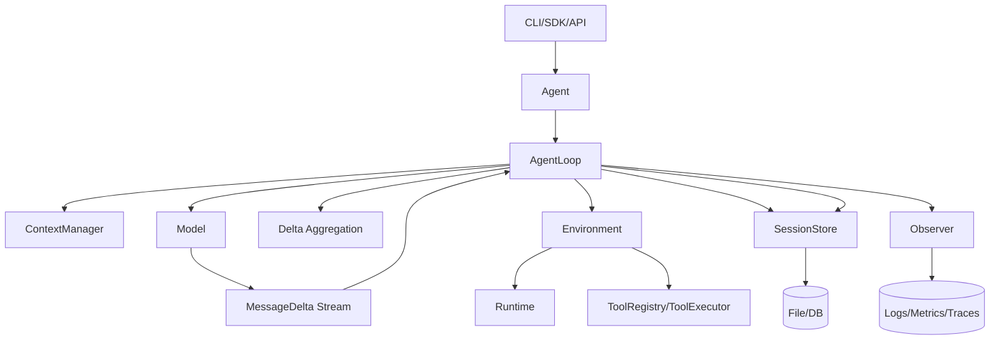

# 01. 整体架构总览

## 目标

构建一个面向通用场景的 agent 框架，具备以下能力：

- 统一模型输出 Message、流式 delta 协议（`MessageDelta`）
- 可控的 agent loop（支持工具、HITL、重试）
- 可回放的 session 持久化
- 可插拔 runtime/tool/model 实现
- 完整观测能力（日志、指标、trace）

可覆盖场景示例：

- Chat assistant
- Tool automation
- Workflow agent
- Code agent（可选垂类）

## 非目标（v0）

- 不做多租户权限系统
- 不做复杂工作流编排 DSL
- 不做分布式多节点调度

## 分层架构

- Application Layer
  - CLI / SDK / API
- Agent Core Layer
  - Agent
  - AgentLoop
  - StateMachine
  - StateMachine
- Domain Layer
  - ContextManager
  - SessionStore
  - Model
  - ToolRegistry/ToolExecutor
  - Runtime
- Infra Layer
  - Filesystem / DB
  - Telemetry
  - Secrets/Config

## 顶层关系图

## 设计原则

- Protocol first：先定义 `Message`/`MessageDelta`/State 契约
- Message-first：对外和持久化主视图统一为 message
- Append-only：session 采用追加写，避免回放歧义
- Deterministic replay：给定同一消息轨迹，重放结果一致
- Explicit state：显式状态机，避免隐式分支
- Fail visible：错误必须可观测、可定位
