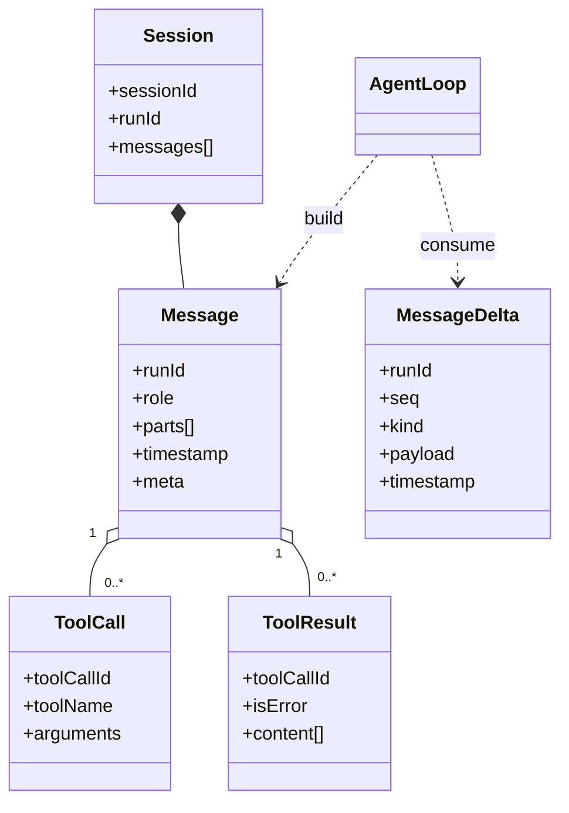

# 02. 核心领域模型

## 核心实体

类级细化（初始化参数、字段、方法签名）见：`docs/14-class-design-index.md`

### AgentConfig

- `model`: 默认模型配置
- `runtime`: runtime 配置
- `tools`: 工具开关与策略
- `context`: 裁剪与压缩策略
- `loop`: 超时、重试、并发参数
- `observability`: 日志/trace/指标配置

### AgentState

- `status`: `idle|preparing|model_running|tool_running|awaiting_human|completed|failed|aborted`
- `currentRunId`
- `pendingToolCalls[]`
- `lastError`
- `tokenUsage`
- `costUsage`

### Session

- `sessionId`
- `runId`（当前活跃 run）
- `messages[]`
- `entries[]`（可选，来自存储层的原始 entry，如 compaction summary）
- `metadata`

### Message

- `runId`
- `role`: `system|user|assistant|tool`
- `parts[]`: `text|thinking|tool_call|tool_result|image|file_ref`
- `timestamp`
- `meta`

### MessageDelta

- `runId`
- `seq`（在单次 `stream` 内单调递增）
- `kind`
- `payload`
- `providerRaw`（可选，调试用）
- `timestamp`

说明：Delta 聚合逻辑可直接在 AgentLoop 内实现为函数/模块，不要求单独暴露为公共类。

### Model

- `stream(...)` -> `MessageDelta` 流
- `update_config()` / `get_config()`
- `supports()` / `modelInfo()`

### ContextManager

- `buildContext(input)` -> `ContextBuildResult`
- `computeContextUpdates(input)` -> `ContextUpdateResult`

### ToolDefinition

- `name`
- `description`
- `parameterSchema`
- `execute()`
- `timeoutMs`
- `requiresApproval`
- `requiresRuntime`（optional）
- `requiresAgent`（optional）

### ToolSpec

- `name`
- `description`
- `parameterSchema`
- `strict`（optional）

说明：`ToolSpec` 由 `ToolDefinition` 提取 schema 信息生成，仅用于 Model 输入，不包含 `agent/runtime` 依赖信息
说明：`agent/runtime` 在工具执行时由 ToolExecutor 注入到执行上下文

## 统一 `MessageDelta` 类型（最小集）

- `start`
  - 模型流开始，携带 `modelId/requestId`
- `text`
  - 增量文本 token
- `thinking`（可选）
  - 推理增量
- `tool_call_start`
  - 新工具调用开始，携带 `toolCallId/toolName`
- `tool_call_args`
  - 工具参数增量（通常为 JSON 字符串增量）
- `tool_call_end`
  - 工具调用参数闭合
- `usage`
  - token/cost 统计增量或最终统计
- `done`
  - 模型输出结束（包含 `finishReason`）
- `error`
  - 模型流异常终止

## 数据关系

## 不变量

- 每条 `tool` message 必须能追溯到唯一 `toolCallId`
- 每个 `toolCallId` 最终只能有一个 terminal result（成功/失败/拒绝）
- `Session` 写入顺序不可逆（append-only）
- 单次 `stream` 内 `MessageDelta.seq` 必须严格递增
- 每个模型流必须以 `done` 或 `error` 之一终止，且只能终止一次
