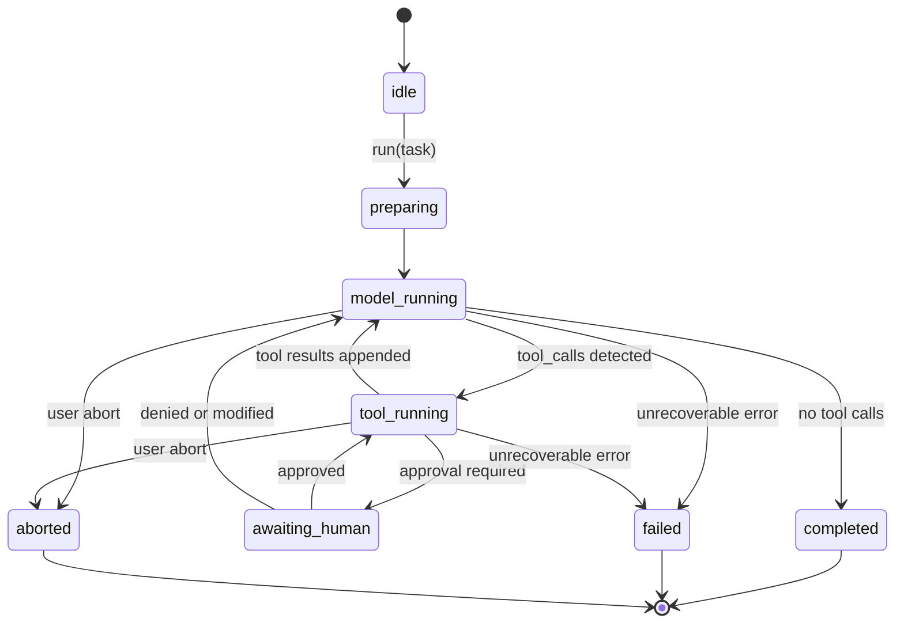

# 03. AgentLoop 与状态机

## Loop 伪代码

```text
initialize_run(sessionId, runId)
session = load_or_create_session(sessionId)
sessionEntries = load_entries(sessionId)
state = preparing
model_call_index = 0

while true:
  model_call_index += 1
  state = model_running
  ctx = contextManager.buildContext({
    sessionEntries,
    inputMessages,
    systemPromptOverride,
    runtimeInitData,
    runtimeHints,
    toolSpecs
  })
  persist(ctx.entriesToAppend)
  context = ctx.modelMessages
  toolSpecs = ctx.modelToolSpecs

  # Delta aggregation happens inline in AgentLoop
  delta_stream = model.stream(
    messages=context,
    toolSpecs=toolSpecs,
    requestMetadata={sessionId, runId, model_call_index}
  )

  for delta in delta_stream:
    assert delta.runId == runId
    dedupe_by(runId, model_call_index, delta.seq)
    consume(delta)
    observer.on_model_delta(delta)  # 可选: 实时输出到 UI/日志

  assistant_message = buildFinalMessage()
  append_session(assistant_message)

  if overflowHint or model_token_overflow:
    ctx_update = contextManager.computeContextUpdates({
      sessionEntries,
      newMessages=[assistant_message],
      overflowHint=true
    })
    persist(ctx_update.entriesToAppend)
    if ctx_update.updatedMessages: refresh_session_view()

  calls = extract_tool_calls(assistant_message)
  if calls is empty:
    state = completed
    break

  state = tool_running
  for call in calls:
    decision = maybe_wait_human_approval(call)
    if decision == abort:
      state = aborted
      finish_run()
      return

    result = execute_tool_or_denied_result(call, decision)
    tool_message = to_tool_result_message(result)
    append_session(tool_message)

finish_run()
```

## 流式处理约束

- 模型层输出必须先归一化为 `MessageDelta`
- Delta 在内存中累积增量，并按需提供 `snapshot` 给前端
- 只有在收到 `done`（或可恢复 `error`）后才提交最终 assistant message
- 工具调用仅从最终 assistant message 中提取，避免上层感知 provider 原始流格式

## 状态机

- `idle`
- `preparing`
- `model_running`
- `tool_running`
- `awaiting_human`
- `completed`
- `failed`
- `aborted`



## 幂等规则

- `runId + model_call_index` 用于模型轮次提交幂等
- `runId + model_call_index + delta.seq` 用于流式增量去重
- 工具执行结果落库后不得重复执行同一 `toolCallId`

## 失败恢复

- 模型失败：按 retry policy 退避重试，并复用同一 `model_call_index`
- 工具失败：写入 tool error message，交给模型决定下一步
- session 写失败：立刻中断 run，避免内存态与持久态分叉
