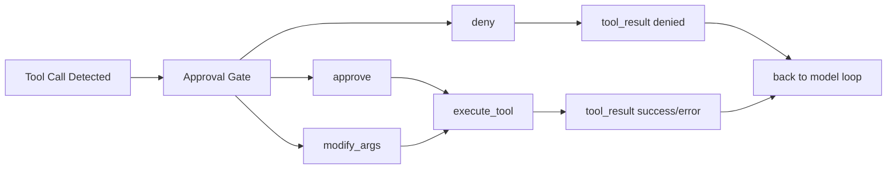

# 08. HITL/HITP 与控制流

## 目标

让高风险工具调用可控、可暂停、可恢复。

## 角色

- Agent
- Human reviewer
- Policy engine（可选）

## 决策点

- `before_tool_execute`
- `during_tool_execute`（长任务）
- `before_result_commit`（可选）

## 审批动作

- `approve`
- `deny`
- `modify_args`
- `pause`
- `resume`
- `abort`

## 持久化记录（建议）

- `approval_required`
- `approval_received`
- `tool_paused`
- `tool_resumed`
- `run_aborted_by_human`

这些记录可写入 `message.meta` 或 session `custom` entry，核心目标是可审计与可回放。

## 处理流程

## 实现注意点

- 审批决策必须落库，且可回放
- `modify_args` 要保留原参数和修改后参数
- deny 也要生成 `tool_result` message，避免 loop 卡住
